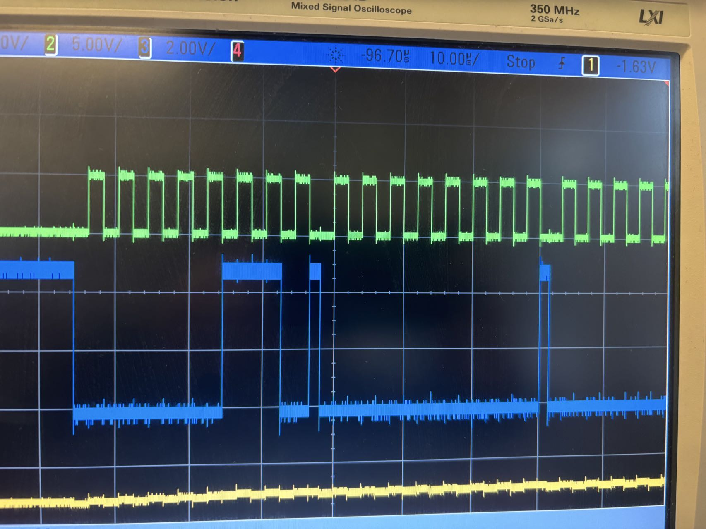
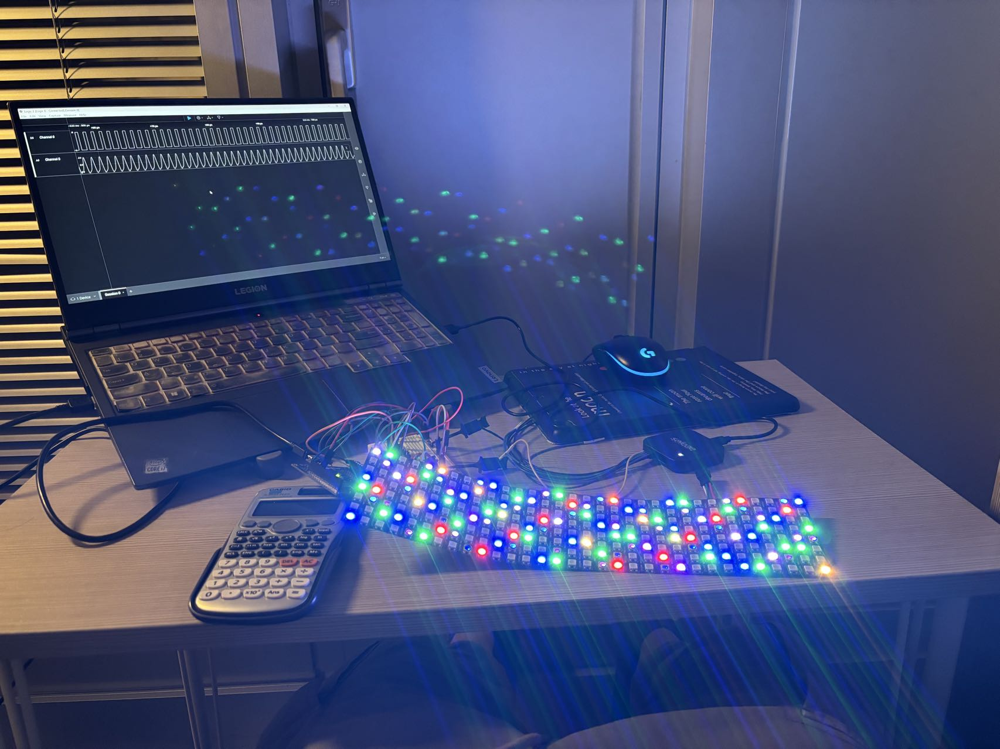
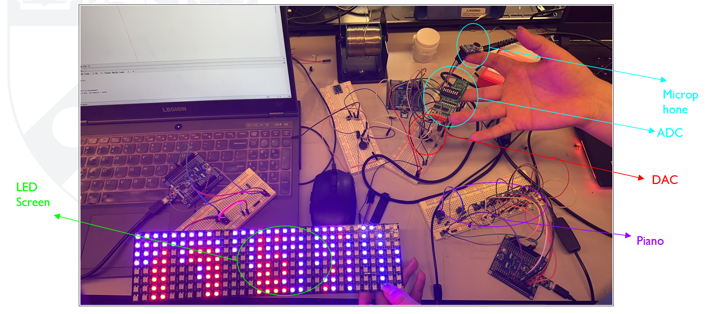
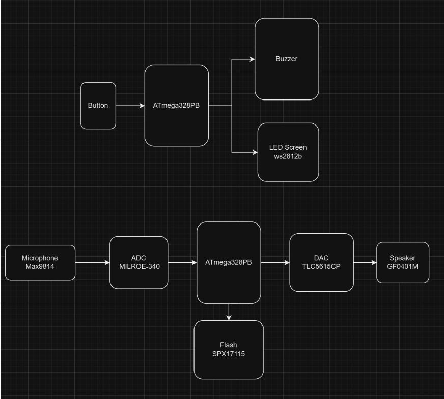

# Audio processor

# final-project-skeleton

    * Team Name: Eureka
    * Team Members: Linhai Deng, Zhongyu Wang and Xiaopeng Jin  
    * Github Repository URL: https://github.com/upenn-embedded/final-project-eureka.git
    * Github Pages Website URL: https://xiaopeng-jin.github.io/team9.github.io/
    * Description of hardware: (embedded hardware, laptop, etc) 

## Final Project Report

### 1. Video

Click the link to see the final video:
The first video is our Powerpoint&presentation.
The second video is our function demo.

[Presentation](https://drive.google.com/file/d/1OvyNMGJ50q6dFk_L6bCDSx9tq8DOD812/view?usp=drive_link)
[Function_demo](final.mp4)

### 2. Images
The following picture is the ADC test result.

The following picture is the LED part.

The following picture is the integration.

The following picture is our final system block.

### 3. Results

Our project achieved significant progress and delivered several functional components as a solution to the outlined challenges:

1. We successfully sampled sound using an external ADC (MCP3204) via SPI communication. The ADC converts analog signals from a microphone into digital signals with a sampling rate of 74.5 kHz and a resolution of 12 bits. This ensures high-quality digital representation of audio inputs.
Accurate Digital-to-Analog Conversion

2. The DAC (TLC5615) converts the processed digital signals back into analog form. The converted signal is then output to the speaker, ensuring a clear and continuous playback experience. The DAC operates at a 10-bit resolution with a sampling rate of 74.5 kHz, maintaining the integrity of the original sound during playback.
Electronic Piano Functionality

3. An electronic piano was implemented using button inputs, where each button corresponds to a specific musical note. The system generates tones of accurate frequency for each button press, allowing users to create simple melodies. This feature demonstrated smooth operation and responsiveness, with no noticeable delay or overlapping sounds.

4. A screen was integrated to display dynamically updated characters and sound waveforms in real-time. The visual representation of sound signals synchronizes with the electronic piano.

5. The system efficiently handles simultaneous operations, including sound recording, playback, tone generation, and waveform display, without any noticeable performance degradation. This was achieved through optimized SPI communication and firmware design.
Debugging and System Monitoring

Additional Observations:

1. The speaker output was clear and accurate for short recordings but highlighted an amplifier limitation when dealing with higher volume or extended playback.

2. The flash memory module integration remains incomplete; while initial communication was established, reliable read/write functionality is yet to be fully implemented for real-time recording and playback.

3. The system demonstrated strong SPI communication across ADC, DAC, and other peripherals, ensuring consistent data transfer and operation.

Overall, the project achieved its core objectives and laid the foundation for further enhancements, particularly in flash memory functionality and speaker output quality.

#### 3.1 Software Requirements Specification (SRS) Results

Achieved

- SRS01: The sampling rate for both ADC and DAC should exceed 40 kHz, with a resolution greater than 8 bits.

    ADC has a sampling rate of 74.5KHz with 12 bit. DAC has a sampling rate of 74.5KHz with 10 bit.

- SRS02: Generate tones corresponding to different musical notes based on button inputs. 

- SRS03: Display sound waveforms dynamically on the screen, updating in real-time based on the input signal.

- SRS04: Utilize SPI communication for data transfer between chip and ADC/DAC/Flash

- SRS05: The system should handle simultaneous operations, such as recording sound via the ADC, displaying waveforms on the screen, and producing tones through button inputs, without noticeable performance degradation.

- SRS07: Provide UART-based debugging functionality to log system operations and detect errors in real time, ensuring maintainability and troubleshooting efficiency.

Not Finished

- SRS06: The flash memory must store audio data safely and allow reliable read/write operations for real-time recording and feedback.

#### 3.2 Hardware Requirements Specification (HRS) Results

Achieved:

- HRS01: All components in the system must operate at either 3.3V to 5V to ensure compability and stable operation. 

- HRS02: Correctly utilize the pins on ATmega328PB while using SPI communication.

- HRS03: GPIO pins on the ATmega328PB must match voltage levels, with 5V as the high logic level. All connections should ensure no voltage mismatches.

- HRS04: No pins in the circuit should be left floating or unconnected, ensuring a robust and functional hardware configuration.

Not finished

- HRS05: Not finish the Flash part.

- HRS06: The speaker's power amplifier is insufficient.

### 4. Conclusion

This project has been a valuable learning experience, offering insights into embedded systems design, audio processing, and hardware integration. Throughout the process, we encountered challenges, celebrated successes, and gained a deeper understanding of system optimization and teamwork.

#### What we learn 

1. We know the whole process of designing, from analysing, thinking about the requirements, picking up device, running code and integrating different components.

2.  We enhanced our knowledge of SPI communication, integrating periperals such as ADC DAC and flash memory into a system.

3. Designing for real-time audio processing gave us practical experience in managing data flow and system performance.

4. It is interesting to integrate all components together. There are so many things to consider like the pins, the clock, the frequency. At the same time, it's valuable experience to debug in a big system. We must check the feasibility of every part before we integrate them together.

#### What went well

1. Successful implementation of SPI communication for sound sampling, processing, and playback.
2. The electronic piano worked as intended, with accurate tones and smooth button responses.
3. The screen integration for dynamic waveform display added an engaging and interactive element to the system.
4. Our screen is able to show the character.
5. All parts work well as a whole.
6. The cooperation and communication between the team is very good.

#### Accomplishments

1. Sample the sound and store the data.
2. Play the saved sound
3. Electronic piano to play different tones
4. Display the LED screen along with the sound.
5. Work as a team to finish the project.

#### Challenges and Changes in Approach

1. The flash memory implementation was more complex than anticipated. About the flash, the code is completed. But in the application, the flash cannot succeed every time. In our initial plan, we want to use the flash to record our data in real time. It is a one-time thing. Therefore, we didn’t integrate it into the circuit. 
2.The challenge lies in the 16MHz system clock being too low for the 1.25µs (800kHz) LED digital signal, making precise PWM generation difficult. Additional computations delay PWM duty adjustments, disrupting timing logic. To address this, hardware PWM modules can minimize software delays, code execution can be optimized, and critical PWM processes can be isolated using task scheduling or DMA.

#### What Could Have Been Done Differently

1. We should be more careful and buy hardware earlier to avoid delays caused by missing components.
2. We should Consider noise filtering and amplification earlier in the design process to improve audio quality.
3. We should set aside more time to make a case for our device.

#### Did you encounter obstacles that you didn’t anticipate?

1. Our device is missing in the process of delivering.
2. I burnt one of the board in the experiment.
3. The results from the DAC were completely opposite to our expectations.
4. The flash's port voltage is 3.3V, which is incompatible with the ATmega328PB.

#### Future development

1. Flash part optimization.

    Complete the integration of Flash memory module for reliable real-time audio data read and write. 

2. Speaker amplication

    Add a suitable OP-AM for our speaker to get enough amplification. It can help imcrease the volume of the sound.

3. Advanced waveform display

    After we integrat the flash into our circuit. We can upgrade the screen to display more detailed and visually appealing sound waveform. We can also introduce additional modes such as frequency spectrum visualization to provide deeper insights into the audio signals.

4. Noise Filtering and Signal Processing

    There is still some noise in our project. We can implement noise filtering techniques, such as low-pass and band-pass filters, to reduce input noise. Incorporate basic signal processing effects like equalization to enhance playback quality.

5. Mechanical Enclosure Design

    We plan to design a portable, protective enclosure to house all components, including the microphone, speaker, buttons, and screen. This will improve usability, durability, and portability.

Just like what I say in the final demo day. The sound made by our project is like the cry of a newbron baby in this field!
